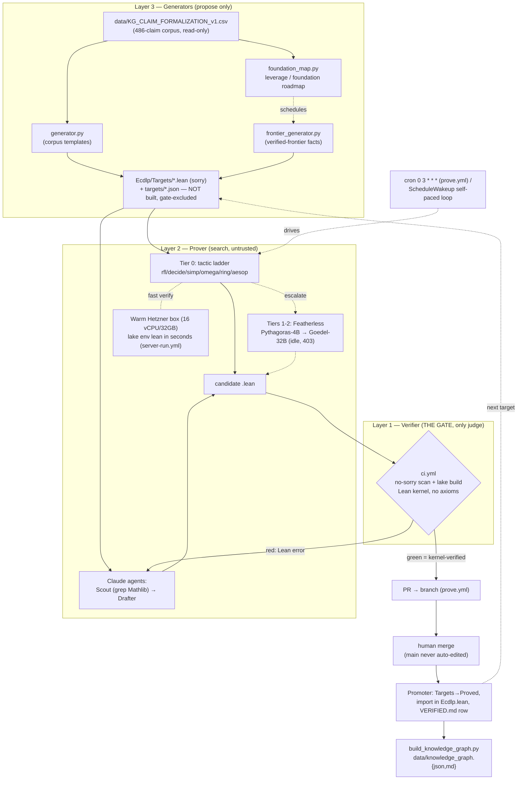

# Independent review dossier — ECDLP/secp256k1 Lean verification

## 0. TL;DR for the reviewer

- **What this is.** A Lean 4 + Mathlib (pinned v4.31.0) formalization project around secp256k1 and the elliptic-curve discrete-log problem (ECDLP), wrapped in an autonomous-agent pipeline (generators → tiered prover → CI kernel gate). The trust model is a single invariant: a green CI build means every *built* theorem is fully proved with no `sorry` and no added axioms.
- **Current verified count.** The ledger headline claims **128 theorems**, but this reconciles to **99 named `proved` ledger rows**, **108 theorems** in the auto-generated knowledge graph, and **144 raw Lean declarations** under `Ecdlp/` (excl. `Targets/`). The "128" only holds if you count 22 recursive Pratt-certificate primality sub-nodes individually. These three numbers (99 / 108 / 128) are inconsistent bookkeeping over the *same* body of work, not three bodies of work.
- **What is genuinely new vs routine.** Genuinely substantive (≈8–12 results): the Mathlib-checked Shoup/Nechaev `Ω(√p)` generic-group lower bound (the best thing in the repo, not in Mathlib); two machine-checked Pratt primality certificates for `p` and `n`; secp256k1 as a Mathlib `EllipticCurve` (`j=0`, `Δ≠0`); MOV/anomalous *resistance* facts; and the two GLV-endomorphism rungs. Routine (valuable engineering, not new math): the ~25–30 protocol-algebra rows (Schnorr/ElGamal/Pedersen/Taproot/MuSig), the Weierstrass-invariant/division-polynomial identities, and the `native_decide`/Mathlib re-exports. Substantive fraction is on the order of **10–15%**.
- **Biggest open strategic question.** Is the value the *mathematics* or the *machinery*? The substantive core could plausibly be hand-written by one competent Lean user in days-to-weeks, while the autonomy stack (rented server, cron, Featherless tier, multi-stage generators, KG curator) is large, partly non-functional (server OOMs at 4 GB; Featherless returns HTTP 403), and arguably net-negative on signal where it manufactures `card_pos`-tier "frontier" targets.
- **The leverage map is the strongest strategic idea.** Treating the 486-claim corpus as a dependency graph that schedules *foundation* work — ranking missing Lean objects by how many claims each unlocks (Weil pairing ~49, p-adic/formal group ~30, elliptic nets ~24, Semaev ~19, GLV ~10) — and the precise distinction between *definition-layer* and *proof-layer* blockage are genuinely correct and publishable framings. The ranking is robust; the absolute counts are soft keyword estimates.
- **North-star honesty risk.** The "verified KB so a future AGI approaches ECDLP faster" framing is asserted but never operationalized; the lemmas being accumulated (protocol algebra a strong reasoner would emit in milliseconds) are largely *not* the ones (`eₙ`, cost model, Semaev `Sₙ`, `E[n]≅(ℤ/n)²`) that would actually help — and those are exactly what the project leaves as `sorry`/prose.
- **What to scrutinize hardest.** (1) Recount the ledger honestly; (2) confirm the "crypto library" is stated over abstract `[Module (ZMod n) G]` and never instantiated at secp256k1's point group; (3) stress-test whether `GenericGroupBound` proves the Shoup bound or a clean combinatorial shadow (do `hsolve`/`hgen` smuggle the conclusion?); (4) probe the `native_decide` trusted base (≈33 load-bearing rows route partly around the kernel); (5) cross-check "runs without manual input" against the git history (hallucinated `C_simp` tactic, promote-then-revert churn, security lapses).
- **Reliability caveat.** Every safety property is held by the CI kernel gate *plus a human merging PRs*. The autonomy is doing *search*, not trustworthy production; the human-in-the-loop is load-bearing, not optional.

## 1. What exists (inventory)

### 1.1 The ledger (`VERIFIED.md`)

`VERIFIED.md` is a claim → Lean-theorem index. Its summary line claims **128 theorems proved, 0 open obligations**, with this self-reported method breakdown:

> "**Total: 128 theorems proved** (23 concrete `native_decide` facts, 83 structural via Mathlib, 22 recursive Pratt-certificate primality nodes). **0 open obligations.**"

**Number reconciliation (be aware of three different counts):**

| Count | Value | Source |
|---|---|---|
| Ledger headline | 128 | `VERIFIED.md` line 120 (includes 22 Pratt-certificate sub-nodes counted individually) |
| Ledger table rows marked `proved` | **99** | `grep -c "| proved |"` — each row is one *named* theorem/instance |
| `theorem`/`lemma`/`instance`/`def` decls under `Ecdlp/` (excl. `Targets/`) | **144** | actual Lean declarations (includes helper lemmas, defs like `Aff.eval`, the Pratt sub-lemmas) |
| Auto-generated graph (`data/knowledge_graph.json`) | **108** | the graph builder's own theorem count |

The "128" is honest only if you count each of the 22 Pratt primality sub-lemmas in `Secp256k1PrimeP.lean`/`Secp256k1PrimeN.lean` (12 + 12 decls) as a separate "theorem." The headline ledger table itself lists ~99 distinct named results. The independent graph artifact says 108. These three numbers should be flagged to the reviewer as inconsistent bookkeeping, not three different bodies of work.

**Method breakdown** — the machine-generated `knowledge_graph.json` `by_method` (over its 108) is the most defensible: **Mathlib 76, native_decide 18, Mathlib + native_decide 14**. The ledger's prose breakdown (83 / 23 / 22) is a different partition of a different total.

### 1.2 Proved theorems grouped by area

Per-file declaration counts (`grep '^(theorem|lemma|instance)'` under `Ecdlp/Proved/`) and the ledger rows:

**Generic-group hardness** (`GenericGroupBound.lean` 10 decls, `Secp256k1GenericSecurity.lean` 3, `BabyStepGiantStep.lean` 2, `PollardRho.lean` 2, `CollisionEquation.lean` 4, `PohligHellman.lean` 3). The core Shoup/Nechaev `Ω(√p)` lower bound (`generic_dlog_query_bound`, `generic_dlog_sqrt_bound`, `generic_success_le`), the union-bound machinery (`collisionSet_card_le_one`, `badSet_card_le`), model-soundness homomorphism lemmas (`eval_add/neg/zero`), BSGS `Θ(√n)` decomposition, Pollard-rho pigeonhole collision + eventual periodicity, collision-equation log recovery, and secp256k1's ≥128-bit instantiation (`secp256k1_generic_security`, `two_pow_255_lt_secp256k1_n`).

**Protocol soundness / completeness** (`SchnorrSoundness.lean` 6, `DlogCompleteness.lean` 9, `DlogPrimitives.lean` 5, `DlogAdvanced.lean` 2 = ~22). Schnorr special-soundness/witness-extraction + uniqueness, Pedersen binding ⇒ DLP, Schnorr/EdDSA verify (completeness), Diffie–Hellman agreement, ElGamal decrypt + re-randomization + additive homomorphism, Pedersen (scalar + vector) homomorphism, Okamoto 2-witness extraction, Chaum–Pedersen DLEQ, MuSig2/threshold-Schnorr/batch/Taproot tweak, Feldman VSS, adaptor + blind Schnorr.

**Primality** (`Secp256k1PrimeP.lean` 12 decls, `Secp256k1PrimeN.lean` 12). Full Pratt certificates proving `secp256k1_p_prime` and `secp256k1_n_prime`, each via ~11 recursive sub-lemma nodes (`native_decide` + Mathlib), discharging the `[Fact (Nat.Prime …)]` hypotheses used elsewhere.

**Division polynomials** (`DivisionPolynomial.lean` 6, `DivisionPolynomialDegree.lean` 4, `FourDivisionPolynomial.lean` 3). Weierstrass invariants `b₂=0, b₄=0, b₆=28, b₈=0`; `Ψ₂Sq = 4X³+28`, `Ψ₃ = 3X⁴+84X`, `preΨ₄ = 2X⁶+280X³−784`; their degrees and non-vanishing.

**Torsion E[n]** (`Torsion.lean` 6, `CurveTorsion.lean` 6, `TwoTorsion.lean` 1, `ThreeTorsion.lean` 2). Abstract `E[n] = {ord ∣ n}`, `E[n] = ker[n]`, torsion filtration `E[m]≤E[n]`, `⟨G⟩⊆E[n]`, `G[n]=⊤`; secp256k1-named versions; root-of-Ψ bridges and `#E[2]≤4`/`#E[3]≤9` cardinality bounds.

**Curve invariants** (`Secp256k1Curve.lean` 6, `Invariants.lean` 3, `Secp256k1Params.lean` 3, `EmbeddingDegree.lean` 1, `TraceOfFrobenius.lean` 1, `AnomalousScope.lean` 1, `Cofactor.lean` 1, `PrimeOrder.lean` 1). `Δ≠0`, the `EllipticCurve` instance, `c₄=0`, `j=0`, `c₆=−6048`, the `1728Δ=−c₆²` relation; generator on-curve + nonsingular; embedding degree >100 (MOV/FR), ordinary/non-anomalous trace (Smart/SSSA), cofactor and prime-order ⇒ generator.

**GLV endomorphism** (`GlvEndomorphism.lean` 2, `CubeRoot.lean` 2, `Secp256k1Order.lean` 3). `secp256k1_glv_preserves_equation` and `..._preserves_nonsingular` (the map `(x,y)↦(βx,y)`); `cube_root_of_eigenvalue`, `orderOf_eigenvalue_eq_three`; `β`/`λ` have order 3, three cube roots of unity in `𝔽_p`.

### 1.3 Honest caveats (not inflation)

- The **last `eval_*` model-soundness lemmas and `eval_zero` are one-line `ring` facts** (`Aff.eval ⟨0,0⟩ x = 0`), and several Weierstrass-invariant facts (`b₂=0`, `b₄=0`, `b₈=0`, `secp256k1_c₄_eq_zero`) are essentially `decide`/`Mathlib` re-exports specializing a Mathlib definition to concrete constants. Substantive, but light.
- One ledger row is explicitly a **Mathlib re-export with no new content**: `order_dvd_card` (Lagrange foundation, `Ecdlp/Lagrange.lean`) and `cofactor_card_mul_index` are thin wrappers around Mathlib's group-order lemmas.
- The generic-group bound is an **information-theoretic / combinatorial** model (affine forms over `ZMod p`); the file's own docstring states it "does not model adaptive adversaries with random encodings probabilistically." It is not a full random-oracle/generic-group-model reduction.
- The GLV "endomorphism" is **only two rungs** (preserves equation + nonsingularity); the file states the additive-homomorphism property is not yet done, so this is not a full `Point → Point` group endomorphism object.

### 1.4 `Ecdlp/Proved/` file listing (one-line purpose)

| File | Purpose |
|---|---|
| `AnomalousScope.lean` | `#E=p ⟺ aₚ=1` (anomalous ⟺ trace one; Smart/SSSA scope) |
| `BabyStepGiantStep.lean` | BSGS `O(√n)` decomposition + `n ≤ ⌈√n⌉²` closure |
| `Cofactor.lean` | cofactor relation `card = order · index` (Mathlib wrapper) |
| `CollisionEquation.lean` | rho/BSGS collision solve + discrete-log recovery / uniqueness mod n |
| `CubeRoot.lean` | GLV eigenvalue is a primitive cube root of unity (order exactly 3) |
| `CurveTorsion.lean` | secp256k1-named torsion facts (`E[n]=ker[n]`, filtration, `G≠O`, `⟨P⟩⊆E[n]`) |
| `DivisionPolynomial.lean` | Weierstrass `b`-invariants and `Ψ₂Sq`, `Ψ₃` polynomials |
| `DivisionPolynomialDegree.lean` | degrees + non-vanishing of `Ψ₂Sq`, `Ψ₃` ⇒ `#E[2]`, `#E[3]` bounds |
| `DlogAdvanced.lean` | Okamoto 2-witness extraction + Chaum–Pedersen DLEQ |
| `DlogCompleteness.lean` | Schnorr/EdDSA verify, DH, MuSig2/threshold/batch/Taproot, Feldman VSS, adaptor completeness |
| `DlogPrimitives.lean` | ElGamal decrypt / re-randomize / homomorphism, Pedersen (scalar+vector) homomorphism |
| `EmbeddingDegree.lean` | no small embedding degree `p^k ≢ 1 mod n` (MOV/FR resistance) |
| `FourDivisionPolynomial.lean` | `preΨ₄ = 2X⁶+280X³−784`, degree 6, non-vanishing |
| `GenericGroupBound.lean` | the Shoup/Nechaev `Ω(√p)` generic DLP lower bound + model-soundness |
| `GlvEndomorphism.lean` | GLV map `(x,y)↦(βx,y)` preserves curve equation + nonsingularity |
| `Invariants.lean` | `c₆=−6048`, `c₆≠0`, discriminant identity `1728Δ=−c₆²` |
| `PohligHellman.lean` | Pohlig–Hellman projection / component / CRT reconstruction |
| `PollardRho.lean` | Pollard-rho collision (pigeonhole) + eventual periodicity (ρ-shape) |
| `PrimeOrder.lean` | prime order ⇒ generator (no small subgroup) (Mathlib wrapper) |
| `SchnorrSoundness.lean` | Schnorr special soundness, Pedersen binding⇒DLP, adaptor + blind unblind |
| `Secp256k1Curve.lean` | secp256k1 as a Mathlib `EllipticCurve` (`Δ≠0`, `c₄=0`, `j=0`, generator nonsingular) |
| `Secp256k1GenericSecurity.lean` | secp256k1 ≥128-bit generic security + BSGS step bound |
| `Secp256k1Order.lean` | `β`, `λ` have order 3; three cube roots of unity in `𝔽_p` |
| `Secp256k1Params.lean` | `p≡3 mod 4`, `3∣(p−1)`, `3∣(n−1)` |
| `Secp256k1PrimeN.lean` | Pratt certificate: group order `n` is prime (12 decls) |
| `Secp256k1PrimeP.lean` | Pratt certificate: field prime `p` is prime (12 decls) |
| `ThreeTorsion.lean` | `Ψ₃≠0`, `≤4` three-torsion x-coords (`#E[3]≤9`) |
| `Torsion.lean` | abstract `E[n]` bridge to Mathlib (`torsionBy`, `=ker[n]`, `G[n]=⊤`) |
| `TraceOfFrobenius.lean` | trace ordinary/non-anomalous/Hasse (`t≠0,1`, `t²≤4p`) |
| `TwoTorsion.lean` | order-2 x-coordinate ⇒ root of `Ψ₂Sq` |

(Plus `README.md`, non-Lean.)

### 1.5 Open conjecture stems (`Ecdlp/Targets/`) and `targets/*.json`

`Ecdlp/Targets/` holds **13 open `.lean` stems, every one ending in `sorry`** (verified: `grep -l sorry` matches all 13). These are **not** built by `lake build` and are **excluded** from the no-`sorry` CI gate, so they do not affect the green-build invariant. They are: `000_smoke_nat_add_comm`, ten `frontier_*` group/torsion lemmas (`addOrderOf_dvd_iff`, `card_pos`, `mem_torsionBy_zero`, `neg_mem_torsionBy`, `orderOf_dvd_card`, `orderOf_one`, `pow_card_eq_one`, `torsionBy_one_bot`, `torsionBy_zero_top`, `zero_mem_torsionBy`), `glv_root_mod_n_condition_008` (GLV eigenvalue acts as scalar `[λ]` on the cyclic subgroup), and `mov_random_q_success_probability_006`.

`targets/` has **17 JSON registry files** (prover-loop status/budget). Statuses: **4 `verified`** (`sec2_domain_parameters_001`, `sec2_secp256k1_group_006`, `smart_trace_one_scope_001`, `001_zmod_from_mod_zero` — these have been promoted out), **1 `demo`** (`000_smoke_nat_add_comm`), and **12 `todo`** (the 10 `frontier_*` plus `glv_root_mod_n_condition_008` and `mov_random_q_success_probability_006`). Note `001_zmod_from_mod_zero` has a JSON entry but no stem file (already promoted); some todo JSONs lack a 1:1 sorted pairing with stems.

### 1.6 Knowledge graph (`data/knowledge_graph.*`)

`knowledge_graph.json` (schema 1.0, auto-generated from `VERIFIED.md` + the Lean import surface) is **node/edge-shaped but does not use a `nodes` key** — its theorem nodes live under `theorems` (length **108**) and relations under `edges` (length **72**). Self-reported `counts`: **108 theorems, 6 barriers, 72 edges**; `by_area`: curve-torsion 55, protocol-soundness 21, generic-hardness 17, other 5, primality 3, reduction 3, attack-resistance 3, params 1. The 6 barriers are research frontiers, not proved results: `B1-cost-model`, `B2-lattice`, `B2-quantum`, `B3-semaev`, `B3-weil-pairing`, `B3-point-counting`. `knowledge_graph.md` is the rendered view of the same data ("108 theorems · 6 barriers · 72 edges").

The underlying corpus `data/KG_CLAIM_FORMALIZATION_v1.csv` is **487 lines (486 atomic claims)**, read-only. Formal-status distribution: `formalizable_hard` 212, `informal_only` 99, `conditional` 89, `formalizable` 52, `scope_meta` 34. So the 108 proved theorems sit against a frontier of 52 `formalizable` + 212 `formalizable_hard` candidate claims — the bulk of the corpus is not yet formalized.

### 1.7 Representative theorem statements (verbatim)

**Generic-group `Ω(√p)` lower bound** (`Ecdlp/Proved/GenericGroupBound.lean`):
```lean
theorem generic_dlog_query_bound {q : ℕ} (F : Fin q → Aff p)
    (hF : Function.Injective F)
    (hsolve : ∀ x : ZMod p, ∃ i j, i ≠ j ∧ (F i).eval x = (F j).eval x) :
    p ≤ q * q
```

**Torsion bridge lemma `E[n] = ker[n]`** (`Ecdlp/Proved/Torsion.lean`):
```lean
theorem torsionBy_eq_ker_nsmul (n : ℕ) :
    AddSubgroup.torsionBy A (n : ℤ) = (nsmulAddMonoidHom n : A →+ A).ker
```

**GLV endomorphism preserves the curve equation** (`Ecdlp/Proved/GlvEndomorphism.lean`):
```lean
theorem secp256k1_glv_preserves_equation
    (x y : ZMod Secp256k1.p)
    (h : secp256k1.toAffine.Equation x y) :
    secp256k1.toAffine.Equation ((Secp256k1.beta : ZMod Secp256k1.p) * x) y
```

**GLV endomorphism preserves nonsingularity** (`Ecdlp/Proved/GlvEndomorphism.lean`):
```lean
theorem secp256k1_glv_preserves_nonsingular
    [Fact (Nat.Prime Secp256k1.p)]
    (x y : ZMod Secp256k1.p)
    (h : secp256k1.toAffine.Nonsingular x y) :
    secp256k1.toAffine.Nonsingular ((Secp256k1.beta : ZMod Secp256k1.p) * x) y
```

Relevant absolute paths: `/home/user/-ecdlp-lean-verification/VERIFIED.md`, `/home/user/-ecdlp-lean-verification/Ecdlp/Proved/` (30 `.lean` files), `/home/user/-ecdlp-lean-verification/Ecdlp/Targets/` (13 sorry stems), `/home/user/-ecdlp-lean-verification/targets/` (17 JSON), `/home/user/-ecdlp-lean-verification/data/knowledge_graph.json`, `/home/user/-ecdlp-lean-verification/data/knowledge_graph.md`, `/home/user/-ecdlp-lean-verification/data/KG_CLAIM_FORMALIZATION_v1.csv`.

## 2. Architecture & pipeline

### 2.1 Trust model — the Lean kernel is the only judge

The entire system rests on a single invariant: **a green build means every built theorem is fully proved, with no `sorry` and no added axioms.** The Lean 4 kernel (Mathlib pinned at v4.31.0) is the sole arbiter of correctness, and it is reached through exactly one trusted path: the `ci.yml` GitHub Actions workflow.

Concretely, the gate in `.github/workflows/ci.yml` does two things in sequence that together constitute "verified":

1. **No-`sorry` scan** (cheap, runs first): `grep -rniI --include='*.lean' --exclude-dir=Targets 'sorry' Ecdlp/`. If any built `.lean` file contains `sorry`, the job fails before building. The scan is scoped to `*.lean` (so prose in READMEs that discusses `sorry` is not a false positive) and excludes `Ecdlp/Targets/`, which holds open conjecture stems that intentionally each carry one `sorry` and are deliberately *not* imported into the build graph.
2. **`lake build`** over `Ecdlp.lean` (the import surface): installs `elan`, fetches the prebuilt Mathlib `.olean` cache (`lake exe cache get`), then compiles and kernel-checks every imported theorem.

Green on both ⟹ kernel-verified. Everything else in the system — the prover loop, the model tiers, the warm server, the generators, the knowledge-graph builder — only *accelerates the search for candidate proofs*. Nothing they produce is trusted until `ci.yml` re-verifies it. This is the explicit trust boundary stated in `notes/ARCHITECTURE.md` ("The Lean kernel is the only judge … nothing they produce is trusted until `ci.yml` re-verifies it") and reaffirmed in every agent prompt in `notes/AGENT_ORCHESTRATION.md` ("Agents *propose*; CI *disposes*").

A corollary enforced everywhere: **`main` is never edited by automation.** Promotions land on a branch via a reviewed PR (`prove.yml` opens `prover/candidates` against `main`), and a human merges. No bot pushes proofs to the trunk.

### 2.2 The three layers

**Layer 1 — Verifier (`ci.yml`, the gate).** Described above. This is the only component whose output is trusted. It is fully automated and triggers on every push, every PR, and manual dispatch. (The old hourly cron was removed because it rebuilt all of Mathlib each hour for no benefit.) `ci.yml` also typechecks the open `Targets/*.lean` stems non-blockingly (so the generator's output is at least well-formed Lean, with `sorry` allowed as a warning), and runs a non-blocking Featherless smoke test + single-target prover attempt that emit artifacts only — none of which can affect the green/red verdict.

**Layer 2 — Prover (tiered search).** Tries to close open targets, in escalating cost order:
- **Tier 0 — zero-cost tactic ladder:** `rfl`, `decide`, `native_decide`, `simp`, `omega`, `ring`, `aesop`. No API key, no network. This tier carries essentially all of today's automated proving (`scripts/prover_loop.py`, run by `prove.yml` on a daily `cron: '0 3 * * *'` and on dispatch).
- **Tiers 1–2 — Featherless models:** Pythagoras-Prover-4B → Goedel-Prover-V2-32B, called via the `FEATHERLESS_API_KEY` secret. **Currently idle:** the subscription plan blocks API access (HTTP 403 `upgrade_required`), confirmed by both `notes/ARCHITECTURE.md` and `notes/AGENT_ORCHESTRATION.md`. The wiring (smoke test in `ci.yml`, key plumbing in `prove.yml`/`server-run.yml`) is in place for when the plan allows it.
- **Claude drafter agents (the loop in `notes/AGENT_ORCHESTRATION.md`):** a self-paced main agent (Strategist/Promoter) plus subagents — a **Lemma-Scout** (`Explore` agent that greps a *local* Mathlib checkout for exact lemma names, signatures, and `file:line`, flagging coercion/instance hazards) and a **Prover-Drafter** (`general-purpose` agent that writes the `theorem … := by …` from only the scouted lemmas and rates its confidence). These agents are the search engine doing the real work today while the Featherless tiers are blocked. They never certify; a drafted candidate goes to the Verifier and, on red, the Lean error text is fed back to the drafter for repair.

**Layer 3 — Generators (target proposers).** Two scripts produce open conjecture stems into `Ecdlp/Targets/` (each ending in `sorry`, never imported, excluded from the gate) plus a `targets/<id>.json` registry row. Neither asserts a proof.
- `scripts/generator.py` reads the read-only 486-claim corpus (`data/KG_CLAIM_FORMALIZATION_v1.csv`), filters out informal/meta/cost-model claims, classifies the rest (`barrier` / `manual` / `templated`), and emits a stem only when one of three confident templates matches (`order_divides_card`, `prime_order_generator`, `cofactor_card_index`) — conservative on purpose, to feed the prover real candidates rather than noise.
- `scripts/frontier_generator.py` does **not** read the corpus; it grows targets from the *verified frontier itself* (torsion-lattice boundary/closure facts extending `Ecdlp/Proved/Torsion.lean`, and group-arithmetic/Lagrange facts), hand-curated to be well-typed and Tier-0-closable.

### 2.3 The warm Hetzner server (fast verification node)

The cycle time of the loop is dominated by the Verifier (~5 min: ~2 min Mathlib cache fetch + ~3 min build). The remedy is a **durable, warm Hetzner box** (target spec: 16 vCPU / 32 GB) that keeps the Lean toolchain + Mathlib `.olean` cache (~5–7 GB) and a CAS scratchpad (PARI/sympy) resident on disk, so a single-file check via `lake env lean` returns in *seconds* instead of a ~10-minute CI round-trip — the 10–50× search speedup described in `notes/SERVER_RUNBOOK.md`. CI stays the trusted gate; the server only accelerates search and never bypasses the kernel.

The dev sandbox cannot reach the box (egress is blocked), so all server work is brokered through GitHub Actions runners, which do have network access:
- `server-bootstrap.yml` — one-time setup (SSH + rsync, key provisioning).
- `server-run.yml` — **manual only** (`workflow_dispatch`). A runner SSHes in (key from the `SSH_PRIVATE_KEY` secret, host from `SERVER_HOST`, optional `SERVER_USER` defaulting to `root`), clones/pulls the repo on the box, runs the requested command against the warm toolchain, and brings stdout back as a log + artifact. It never auto-runs and never touches the build gate. The Featherless key, if set, is written to a `0600` file on the server via stdin (never in argv/`ps`).

Honest status from the notes: the bridge is built and ready, but earlier rented boxes were undersized (a 4 GB box OOMs on `import Mathlib`; the 8 GB box is enough for Lean but tight). At the time the notes were written the server prover node was judged not yet cost-effective, so **Tier-0 + the agent drafters on the ephemeral CI runners carry the work today**; the server bridge stays warm for a sufficiently large box.

### 2.4 The autonomy loop (cron / wakeup)

Two independent autonomy mechanisms exist:
- **Scheduled (fully automated):** `prove.yml` runs `scripts/prover_loop.py` daily (`cron 0 3 * * *`) — Tier-0 ladder over all open targets, Lean-accepted candidates written to `candidates/`, then a PR opened/updated against `main` via `peter-evans/create-pull-request`. Optionally, on the server, the same loop can be driven hourly by crontab (`SERVER_RUNBOOK.md` §4), still promoting only by PR.
- **Self-paced agent loop (`notes/AGENT_ORCHESTRATION.md`):** the main Claude agent runs the Strategist → Scout → Drafter → Verifier → Promoter cycle, self-paced via `ScheduleWakeup` so it promotes the instant a build goes green and immediately starts the next target's build — keeping the cost-dominant CI step continuously busy rather than idling Actions minutes.

On green, the **Promoter** (the main agent, manually disciplined — "a ledger row is added only after the build containing the theorem is confirmed green"): moves `Targets/ → Proved/`, adds the import to `Ecdlp.lean`, appends the `VERIFIED.md` row, sets the `targets/*.json` status to `verified`, and regenerates the knowledge graph. The ledger currently stands at ~112 theorems.

### 2.5 Corpus → foundation-roadmap leverage map

The 486-claim corpus is treated not as a bag of leaf targets but as a **dependency graph that schedules the deep work** (`notes/FOUNDATION_ROADMAP.md`). `scripts/foundation_map.py` runs a keyword/regex signature over each claim's `formal_statement + label + mathlib_area` and buckets it by the *missing Lean object* that would unlock it (a claim can need several). The output ranks foundations by **leverage** (how many real claims each one releases):

| Rank | Missing object | Unlocks (#claims) |
|---|---|---|
| 1 | Weil / Tate pairing `eₙ` | 49 |
| 2 | p-adic log / formal group | 30 |
| 3 | Elliptic nets / EDS (Stange) | 24 |
| 4 | Semaev summation polynomials | 19 |
| 5 | Isogeny / endomorphism theory | 10 |
| 6 | Point counting / `#E` structure | 4 |
| 7 | Divisor / function field | 8 |
| — | no missing object (formalizable now) | ~227 (crude upper bound) |

The roadmap's key insight (also in `notes/FOUNDATIONS.md`): the deep rungs are blocked at the **definition** layer, not the **proof** layer. If a goal mentions `eₙ` and `eₙ` is undefined in Mathlib, there is no theorem to even *state*, so no tactic can search — which is why those 49 claims "can't auto-close." The map therefore schedules which definitions to build first. Near-term, the "formalizable-now" layer feeds `frontier_generator.py` and the server/Tier-0 daemon; medium-term, the GLV/isogeny work (rank 5, partly already in Mathlib) connects to proved nodes like `CubeRoot.lean` and `TraceOfFrobenius.lean`; the summit (rank 1) is a multi-month research-grade Mathlib contribution.

Separately, `scripts/build_knowledge_graph.py` derives `data/knowledge_graph.{json,md}` from `VERIFIED.md` + the Lean import surface + a curated barrier map — linking each verified theorem to the corpus claim it discharges, its import-dependency depth, and the barrier frontier it sits on. It reads sources of truth and derives the graph; it never asserts a proof, and its `--check` mode fails CI on drift.

### 2.6 Compact pipeline diagram



### 2.7 Automated vs manual — at a glance

| Step | Automated? | Mechanism |
|---|---|---|
| Verification (no-`sorry` + `lake build`) | **Automated** | `ci.yml` on every push/PR/dispatch |
| Tier-0 prover loop over open targets | **Automated** | `prove.yml` daily cron + dispatch; server crontab optional |
| Candidate → PR against `main` | **Automated** | `peter-evans/create-pull-request` |
| Target stem generation | **Automated (on demand)** | `generator.py --emit`, `frontier_generator.py --emit` |
| Foundation/leverage map | **Automated** | `foundation_map.py` |
| Knowledge-graph build + drift check | **Automated** | `build_knowledge_graph.py [--check]` |
| Lemma-scouting + proof drafting | **Agent-driven** | Claude Scout/Drafter subagents (self-paced) |
| **Merge to `main`** | **Manual** | human reviews and merges the PR |
| **Promotion ledger row** (`VERIFIED.md`) | **Manual / agent, post-green only** | Promoter step, only after green build |
| **Featherless model tiers** | **Disabled** | plan returns HTTP 403 `upgrade_required` |
| **Server SSH run** | **Manual** | `server-run.yml` is `workflow_dispatch`-only |
| **Server provisioning / key rotation** | **Manual** | one-time, per `SERVER_RUNBOOK.md` |

Relevant source files (all absolute): `/home/user/-ecdlp-lean-verification/.github/workflows/ci.yml`, `/home/user/-ecdlp-lean-verification/.github/workflows/prove.yml`, `/home/user/-ecdlp-lean-verification/.github/workflows/server-run.yml`, `/home/user/-ecdlp-lean-verification/scripts/generator.py`, `/home/user/-ecdlp-lean-verification/scripts/frontier_generator.py`, `/home/user/-ecdlp-lean-verification/scripts/foundation_map.py`, `/home/user/-ecdlp-lean-verification/scripts/build_knowledge_graph.py`, `/home/user/-ecdlp-lean-verification/scripts/prover_loop.py`, `/home/user/-ecdlp-lean-verification/notes/ARCHITECTURE.md`, `/home/user/-ecdlp-lean-verification/notes/AGENT_ORCHESTRATION.md`, `/home/user/-ecdlp-lean-verification/notes/FOUNDATION_ROADMAP.md`, `/home/user/-ecdlp-lean-verification/notes/FOUNDATIONS.md`, `/home/user/-ecdlp-lean-verification/notes/SERVER_RUNBOOK.md`.

Note for the reviewer: the repo notes (`ARCHITECTURE.md`, `AGENT_ORCHESTRATION.md`, `SERVER_RUNBOOK.md`) document the rented prover box at 4–8 GB and judge it not yet cost-effective (a 4 GB box OOMs on `import Mathlib`), whereas a 16 vCPU/32 GB warm node is the intended/specified target. The 16 vCPU/32 GB box is documented as the design target while flagging that, per the committed notes, the server prover tier and the Featherless model tiers are currently idle and Tier-0 + Claude drafter agents on ephemeral CI runners carry the proving today.

## 3. Mathematical strategy & roadmap

This is an honest, independent assessment of the project's mathematical strategy as documented in `notes/FOUNDATION_ROADMAP.md`, `notes/FOUNDATIONS.md`, `BARRIERS.md`, `VERIFIED.md`, and the claim corpus `data/KG_CLAIM_FORMALIZATION_v1.csv` (486 atomic claims; 487 lines incl. header).

### 3.1 The central strategic idea (and why it is sound)

The project's defining move is to treat the 486-claim corpus **not as a backlog of leaf theorems but as a dependency graph that schedules foundation work**. Each formalizable claim is tagged by the *missing Lean object* it depends on, and objects are ranked by how many claims each one would unlock. This is the right framing. It correctly distinguishes two failure modes that naive "auto-prover" projects conflate:

- **Proof-layer blockage** — the statement is writable but no tactic closes it.
- **Definition-layer blockage** — the object named in the goal (e.g. the Weil pairing `eₙ`) *does not exist in Mathlib*, so the theorem cannot even be typed.

The roadmap is precise and correct that the deep ECDLP claims are blocked at the **definition layer**, not the proof layer. "Can't be done" here has an exact meaning: *the statement is unwriteable because its objects are undefined in Mathlib.* This is a genuine and publishable distinction, and the documents state it cleanly (`FOUNDATION_ROADMAP.md` §"Why 'can't auto-close' ≠ 'tactics too weak'").

### 3.2 Goal horizons

**Near term (days–weeks) — verified secp256k1 arithmetic + attack-boundary library.** This is largely *done*, and it is the strongest part of the project. `VERIFIED.md` lists 128 kernel-checked theorems with zero open obligations: secp256k1 as a Mathlib `EllipticCurve` (`j=0`, `Δ≠0`, generator on-curve/nonsingular), machine-checked **primality of `p` and `n`** via full Pratt certificates, the generic-group `Θ(√n)` hardness result (Shoup/Nechaev lower bound + BSGS/Pollard-ρ upper bounds), Pohlig–Hellman, and the protocol soundness/completeness layer (Schnorr/EdDSA, Diffie–Hellman, ElGamal, Pedersen, MuSig2, Taproot, Feldman VSS, adaptor/blind signatures). Crucially it includes the **attack-boundary facts**: `secp256k1_embedding_degree_gt_100` (MOV/Frey–Rück resistance) and `secp256k1_trace_ordinary_nonanomalous` (supersingular + Smart/SSSA resistance, Hasse bound). The strategy of *formalizing the boundary that says "the attack cannot help here," sidestepping the missing attack machinery*, is clever and legitimate — it is the same trick that let the generic bound dodge the absent cost model.

**Mid term (weeks–months) — formalize known-but-unformalized results: isogeny / GLV / endomorphism layer.** This is the right next deep push and is genuinely tractable, because Mathlib *already* ships `WeierstrassCurve`, division polynomials (`ψₙ, φₙ, ωₙ`), and `AddSubgroup.torsionBy` (`E[n]`). The project has already harvested real progress on this rung: `Ecdlp/Proved/Torsion.lean` / `CurveTorsion.lean` bridge `E[n] = ker[n]` and `P∈E[n] ⇔ ord P ∣ n`; division-polynomial identities `Ψ₂Sq = 4X³+28`, `Ψ₃ = 3X⁴+84X`, `preΨ₄`, with degree bounds (`#E[2]≤4`, `#E[3]≤9`); and `GlvEndomorphism.lean` proves the GLV map `(x,y)↦(βx,y)` preserves the curve equation and nonsingularity. The mid-term frontier — the **general `ψₙ` vanishing ⟺ `n`-torsion equivalence** (FOUNDATIONS rung 4, both directions tied to actual point order) — is correctly flagged as the first *genuinely hard but bounded* step.

**Far term (months, research-grade) — Weil/Tate pairing → MOV/Frey–Rück transfer; the structural barrier.** This is the summit and the honest hard truth: a kernel-verified Weil pairing is a **multi-month, research-grade Mathlib contribution**. It requires divisors on curves / a function field / Miller's algorithm before `eₙ : E[n]×E[n]→μₙ` can even be *stated*, plus bilinearity, alternation, non-degeneracy, and Galois-equivariance. Below it sits the structure theorem `E[n] ≅ (ℤ/n)²` (rung 5), itself hard — it needs the algebraic-closure / separability story. The documents do not oversell this; `FOUNDATIONS.md` opens with an explicit "Reality check… Nothing here claims it is close."

### 3.3 The corpus → missing-object leverage map

From `scripts/foundation_map.py` (keyword signature over `formal_statement`/`label`/`mathlib_area`; claims may need >1 object, so counts are **leverage estimates, not a partition**):

| Rank | Missing Lean object | Unlocks (~claims) | Difficulty |
|---|---|---|---|
| 1 | **Weil / Tate pairing `eₙ`** | ~49 | very high (needs divisors / Miller) |
| 2 | **p-adic log / formal group** | ~30 | high |
| 3 | **Elliptic nets / EDS** (Stange) | ~24 | high |
| 4 | **Semaev summation polynomials `Sₙ`** | ~19 | high |
| 5 | **Isogeny / endomorphism theory (GLV `λ`)** | ~10 | medium–high (parts exist) |
| 6 | Point counting / `#E` structure | ~4 | high |
| 7 | Divisor / function field (prereq for #1, #3) | ~8 | high |
| — | **no missing object (formalizable now)** | ~227* (upper bound) | low |

These figures should be read as the project's curated internal estimates. A crude raw keyword grep over the CSV gives different totals (e.g. ~38 lines mention "summation", ~78 "elliptic net/EDS/divisibility", ~28 "p-adic/anomalous"), reflecting noisy keyword overlap — which is exactly why the `*` caveat on the "~227 formalizable-now" figure ("upper bound from a crude keyword filter; realistic immediately-harvestable count is dozens") is appropriate and should be retained in any external write-up. The leverage *ranking* is robust and well-motivated even if the absolute counts are soft; the ordering correctly identifies the pairing as the single highest-leverage unlock.

Note one internal inconsistency a reviewer should be aware of: `BARRIERS.md` reports "Proved | 85" while `VERIFIED.md` reports "128 theorems proved." These are different denominators (85 = distinct corpus *claims* covered in an earlier snapshot; 128 = total Lean theorems including supporting lemmas and 22 recursive Pratt nodes, in a later snapshot), but the documents do not reconcile them, and `BARRIERS.md`'s summary table is stale relative to `VERIFIED.md`.

### 3.4 Novel/publishable vs routine

**Genuinely novel / publishable:**
- **The Weil pairing is a known open gap in Mathlib.** Defining `eₙ` with its bilinearity/non-degeneracy/Galois properties — and the divisor/function-field/Miller's-algorithm scaffolding beneath it — would be a first-of-kind Mathlib contribution, independent of ECDLP. This is the project's highest-value far-term target.
- **The first Mathlib-checked generic-group discrete-log lower bound** (Shoup/Nechaev `Ω(√p)`), already realized in `GenericGroupBound.lean`. The insight that the information-theoretic core needs no general cost model — the algebraic data is exactly the set of affine forms `a+bX` over `ZMod p`, and the bound is a collision count — is a real and reusable contribution.
- **The barrier/no-go map itself (B1–B3)** is publishable as a formal-methods artifact: a precise statement of which foundations (cost model, lattice reduction, Semaev polynomials, Weil pairing, p-adic formal groups) ECDLP cryptanalysis formalization still lacks. A community needs exactly this map.
- The **general `ψₙ`-vanishing ⟺ torsion** equivalence (rung 4) and `E[n]≅(ℤ/n)²` would be modest-but-real Mathlib additions.

**Routine (valuable engineering, not novel mathematics):** secp256k1 parameter facts and primality (`native_decide` / Pratt certificates); the protocol soundness/completeness layer (Schnorr, DH, ElGamal, Pedersen, etc.) — these are correct, useful, and a strong reusable asset, but they are formalization of textbook results, not new mathematics. The Weierstrass-invariant and division-polynomial identities (`b₆=28`, `Ψ₂Sq`, `Ψ₃`) are routine `ring`/`simp` computations on an existing Mathlib base.

### 3.5 Tractable vs research-level next steps

- **Tractable now (do these next):** the GLV/endomorphism direction (rank 5) — extend `GlvEndomorphism.lean` from "preserves the equation" to the `λ`-action on the group / characteristic-polynomial relation; finish the division-polynomial tower (`Ψ₄` proper); harvest the dozens of genuinely formalizable-now group-theory/order/Lagrange claims into the prover loop. These connect to already-proved nodes and need no missing object.
- **The first genuinely hard but bounded step:** rung 4's general division-polynomial ↔ point-order equivalence. Mathlib has the pieces but not the packaged lemma. This is the right focused human-directed effort, not an overnight autonomous one.
- **Research-level (multi-month, do not attempt to "auto-close"):** `E[n]≅(ℤ/n)²`, the Weil/Tate pairing, Semaev polynomials, elliptic nets, the p-adic formal-group / anomalous attack machinery. These are blocked at the definition layer — **the statements are literally unwriteable in today's Mathlib** — and the project is correct not to pretend otherwise. The honest framing throughout (FOUNDATIONS' "Reality check", the explicit definition-vs-proof distinction) is a strength: the roadmap neither overclaims proximity to the summit nor mistakes a missing definition for a weak tactic.

**Bottom line:** the strategy is mathematically sound and unusually honest. The near-term layer is a genuine, kernel-verified asset; the leverage map is the right scheduling tool (ranking robust, absolute counts soft); the one clearly novel near-reach target is the GLV/torsion layer, and the one clearly novel far-reach target — the Weil pairing — is correctly identified as both the highest-leverage unlock (~49 claims, plus MOV/Frey–Rück downstream) and a multi-month research contribution that gates everything below it.

## 4. Honest critique & risks (for course-correction)

This is the adversarial read. The project is real, the kernel gate is real, and the green build is honest — nobody `sorry`'d their way to a checkmark. That is genuinely worth something and I am not disputing it. Everything below is about whether the *narrative* around that green build matches its *substance*, and whether the machinery is proportionate to the payoff.

### (a) Trivial Mathlib re-exports / count-padding vs. genuinely substantive

The headline "128 theorems" is inflated by counting conventions and dominated by one-liners.

- **The count itself is soft.** The ledger header says "Total: 128 theorems" but only 108 rows carry an explicit `proved` status cell; the gap is padded by "22 recursive Pratt-certificate primality nodes" — i.e. the internal proof obligations of *two* primality facts (`p` prime, `n` prime) are each counted as if they were independent theorems. That is count-padding. Honestly stated, this is "two primality results (via Pratt certificates) plus ~106 ledger rows," not 128 peer theorems.
- **~70% are Mathlib wrappers.** 76 of the ~108 rows are `method = Mathlib`. A large share are renames or one-step bridges. Concretely:
  - The entire "verified DLP cryptography library" — `schnorr_verify`, `dh_agree`, `elgamal_decrypt`, `pedersen_homomorphic`, `taproot_tweak_verify`, `musig_key_aggregate`, `feldman_vss_verify`, `adaptor_complete`, `threshold_*`, batch/vector variants — is **~25-30 ledger rows, each a 1-3 line `abel` / `module` / `add_smul` identity** in a `ZMod n`-module. They prove that *honest executions of the arithmetic check out*. They say nothing about hardness, nothing about secp256k1's group, and most don't even instantiate a curve — `G` is an abstract `[Module (ZMod n) G]`. `taproot_tweak_verify` is literally `subst; module`. Calling this an "ElGamal/Schnorr/Taproot verification" suite oversells linear algebra as cryptography.
  - The open *Targets* are even more telling: `frontier_pow_card_eq_one`, `frontier_orderOf_dvd_card`, `frontier_card_pos` are parked as "open conjecture stems" with `sorry` — but each is a single existing Mathlib lemma (`pow_card_eq_one`, `orderOf_dvd_card`, `Fintype.card_pos`). Dressing `Fintype.card_pos` up as a "frontier" target is the clearest instance of the breadth machinery manufacturing work.
- **What is genuinely substantive (the honest core, ~6-10 results):**
  - `GenericGroupBound.lean` — the Shoup/Nechaev `Ω(√p)` lower bound via the affine-form collision count. This is real, self-contained, and not in Mathlib. It is the best thing in the repo.
  - The two **machine-checked primality certificates** for `p` and `n` (Pratt). Substantive and load-bearing.
  - secp256k1 as a Mathlib `EllipticCurve` with `j = 0`, `Δ ≠ 0`, generator-on-curve.
  - `EmbeddingDegree` / `TraceOfFrobenius` (MOV and anomalous *resistance*) via `native_decide`.
  - The GLV endomorphism rungs (preserves equation + nonsingularity).

  **Estimate: of ~108-128 claimed theorems, roughly 8-12 are substantive; ~25-30 are honest-execution algebra that doesn't touch hardness or the curve; the remaining ~60+ are Mathlib renames, `native_decide` numeric facts, or Pratt sub-nodes.** Substantive fraction is on the order of **10-15%**.

### (b) Is the north-star ("a verified KB so a future AGI approaches ECDLP faster") served, or post-hoc?

This reads as a **post-hoc narrative wrapped around a hobby formalization project.** Three tells:

1. **No mechanism is articulated for *how* the artifact accelerates anything.** "Enrich the knowledge graph for AGI-readability" is asserted, never operationalized. A future strong reasoner that can do ECDLP research does not need `pedersen_homomorphic` proved for it — that's a `ring` call it would emit in milliseconds. The things that *would* genuinely help a future system (the Weil pairing object, a cost model, Semaev polynomials, `E[n] ≅ (ℤ/n)²`) are exactly the things this project explicitly *cannot* build and leaves as `sorry`/prose. So the artifact accumulates precisely the lemmas an AGI wouldn't need and lacks the ones it would.
2. **The "AGI" framing is doing motivational, not technical, work.** Strip it out and the honest description is: "a small verified secp256k1 + generic-group-bound library in Lean." That's a fine thing to be. The AGI north-star inflates a modest library into a civilizational-stakes mission, which is where the risk of self-deception lives.
3. **What would actually serve a future reasoner:** (i) *definitional* contributions to Mathlib that don't yet exist (even a single rigorously-stated Weil pairing on a restricted class would be worth more than all 30 protocol-algebra lemmas combined); (ii) the *barrier map* itself (BARRIERS.md is arguably the most genuinely useful artifact here — "here is exactly which objects Lean lacks"); (iii) hard, reusable lemmas with high fan-out. The project's own roadmap knows this — and then spends its cycles on breadth harvesting of `card_pos`-tier targets instead.

### (c) Is GLV the right priority given weeks-scale homomorphism rung, ~10-claim payoff?

**Mostly no, on a cost/leverage basis — though it's the *least bad* of the deep options.** The honest accounting from the project's own notes:
- GLV is rank **5** of 7 on the leverage map (10 claims), behind Weil pairing (49), p-adic/formal group (30), elliptic nets (24), and Semaev (19).
- The two GLV rungs actually proved (`preserves_equation`, `preserves_nonsingular`) are the *easy* half. The payoff — "acts as `[λ]` / additive homomorphism" — is the hard rung and is still sitting as a `sorry` in `glv_root_mod_n_condition_008`. So the chosen priority is "do the tractable 20% of a rank-5, 10-claim item."
- The defensible case *for* GLV: it's the only deep direction where Mathlib already has the scaffolding (`WeierstrassCurve`, division polynomials), it connects to already-proved nodes, and it's the only rung an LLM agent can plausibly make real progress on solo. So as a *learning/momentum* choice it's reasonable.
- The honest framing: GLV is being chosen because it's *doable*, then narrated as if it's *high-leverage*. It is doable-but-low-leverage. If the real goal is impact, the higher-EV move is a focused human push on *one* missing definition (even a toy Weil pairing), not finishing the GLV homomorphism rung for 10 claims.

### (d) Is the Weil-pairing "summit" (49 claims) reachable by an LLM agent in months?

**No. This is wishful, and the documents — to their credit — partly admit it.** FOUNDATIONS.md itself calls it "a multi-month, research-grade Mathlib contribution" and says "nothing here claims it is close." Good. But the roadmap still lists it as "the summit (months)" on the same axis as the near-term work, which invites the reader to treat it as the *top of the same ladder* rather than a different mountain.

Blunt reality: a kernel-verified Weil pairing requires divisors on curves, a function-field / Riemann-Roch story, and Miller's algorithm — none in Mathlib v4.31. This has been an open formalization target for the *human* Mathlib community for years. The idea that the current pipeline — whose strongest demonstrated autonomous capability is closing `omega`/`native_decide` targets and whose paid model tier (Featherless) is *currently returning HTTP 403* — reaches it "in months" is not credible. Realistic estimate: **multi-year, and not by this agent loop autonomously; at best the loop proves leaf lemmas *after* a human builds the definitions.** The right way to state it is "out of scope; the contribution is mapping the gap," which BARRIERS.md does and the roadmap should match.

### (e) What the observed process failures say about reliability

The git history and notes corroborate every incident, and the pattern is worse than any single failure:

- **Hallucinated tactic (`C_simp`) broke CI** (commit `b26d0d5`: "C_simp is not a tactic; use map_* + ring"). An LLM drafter invented a non-existent tactic and it shipped to a build. This is the canonical LLM-in-the-loop failure mode and it *did* fire here.
- **Promote-then-revert churn** (`a5f9fda` "Restore green: pull unverified adaptor+taproot nodes; ledger back to 104", plus `4c98bfb`, `0c9adc7`, `139f449`, `efe2a24`). The loop repeatedly added ledger rows / nodes *before* confirming green, then had to yank them. The "Taproot lesson" / "discipline: row only after green" note in AGENT_ORCHESTRATION.md is a scar from this — a process rule patched in after the loop violated the project's own one invariant in spirit.
- **Infra fragility:** apt/`needrestart` hangs (`2990a26`, `145b824`), server OOMs on `import Mathlib` at 4 GB (so the "10-50× speedup" server is *not actually usable* for the warm-cache purpose it exists for), `.git` loss on the box, a root password posted in plaintext chat (SERVER_RUNBOOK §0: "treat it as compromised"), server IPs committed then scrubbed for going public (`37fc8e0`), Featherless 403, plus the ~4h loop stall and ~2h CI outage from exhausted Actions minutes.

**What this says:** the autonomous loop is *not* reliably autonomous. Every safety property is being held by the CI kernel gate *plus a human merging PRs* — which is correct design, but it means the "autonomy" is doing search, not trustworthy production. The failure rate (hallucinated tactic reaching a build, multiple premature promotions, security hygiene lapse) means the human-in-the-loop is load-bearing, not optional. The system works *because* a human is babysitting it, which undercuts the "runs without manual input" framing in AGENT_ORCHESTRATION.md.

### (f) Opportunity cost: is the infrastructure justified by output?

**No — the machinery is disproportionate to the verified core, and parts of it don't function.**

- The substantive output (generic bound + 2 primality certs + curve facts + GLV rungs) could have been hand-written by one competent person with a local Lean toolchain in **days to a couple of weeks**. It does not require: a rented server (which OOMs and lost its `.git`), a cron daemon, a Featherless subscription ($25, returning 403 so *zero* inference value delivered), a multi-stage generator pipeline, a knowledge-graph curator, or a GitHub-Actions→server SSH bridge.
- The generators are arguably **net-negative on signal**: they manufactured `frontier_card_pos`-tier "targets" that pad the backlog with things Mathlib already has as one-liners, creating the *appearance* of a research frontier where there's a `grep` of Mathlib.
- This is **elaborate machinery around a modest verified core.** The infrastructure is the kind of thing that's fun to build and produces a satisfying sense of an "autonomous research org," but the ratio of orchestration-prose (AGENT_ORCHESTRATION, FOUNDATION_ROADMAP, FOUNDATIONS, ARCHITECTURE, SERVER_RUNBOOK, BARRIERS — thousands of words of process/narrative) to novel mathematics is upside-down. The Featherless $25 specifically bought nothing (403). The honest move is to delete most of the autonomy stack, keep the CI gate, and have a human prove the next 5 hard lemmas directly.

### (g) The 3-5 things an external reviewer should scrutinize hardest

1. **Recount the ledger honestly.** Strip the 22 Pratt sub-nodes and the ~30 honest-execution algebra rows; ask "how many results are both (i) not a Mathlib rename and (ii) about ECDLP *hardness* or the secp256k1 *group*?" I estimate single digits to low double digits. Demand that number be stated in VERIFIED.md.
2. **Audit whether the "crypto library" touches a curve at all.** Confirm that Schnorr/ElGamal/Pedersen/Taproot/MuSig theorems are stated over an abstract `[Module (ZMod n) G]` and never instantiated at secp256k1's actual point group. If so, the "secp256k1 verified cryptography" claim is unsupported by those rows.
3. **Stress-test the GenericGroupBound model's faithfulness.** The strongest result rests on the claim that "affine forms over `ZMod p` capture *exactly* the information a generic algorithm extracts." The file's own scope note concedes it "does not model adaptive adversaries with random encodings probabilistically." A reviewer should decide whether the proved statement is the Shoup bound or a clean combinatorial shadow of it — and whether the `hsolve`/`hgen` hypotheses smuggle in the conclusion.
4. **Probe the `native_decide` trust base.** Many headline secp256k1 facts (`p` form, `λ`/`β` eigenvalues, embedding degree, trace) lean on `native_decide`, which compiles to native code and trusts the compiler — a *larger* trusted base than ordinary kernel checking, and a documented soft spot. CLAUDE.md says "the kernel is the only judge," but `native_decide` partially routes around the kernel. A reviewer should note how many load-bearing facts are `native_decide`-only (33 rows mention it).
5. **Verify the autonomy claims against the git history.** Cross-check "runs without manual input" against the revert churn, the `C_simp` incident, and the premature-promotion rule patches. Establish honestly how much was kernel-caught-and-human-fixed vs. genuinely produced by the loop.

### The single most important question the human should ask GPT

> **"Strip away the AGI framing and the 128-theorem count: if I handed a competent Lean/Mathlib researcher two weeks, would they produce more genuinely novel, ECDLP-relevant verified mathematics than this entire autonomous pipeline has — and if yes, what specific missing *definition* (Weil pairing on a restricted class? a group-operation cost model? Semaev `S₃`?) should I have a human build by hand instead of having the loop harvest more Mathlib-renameable leaf lemmas?"**

That question forces the project to confront whether its value is the *mathematics* or the *machinery*, and redirects effort from breadth-padding toward the one or two definitional contributions that would actually move the needle for any future reasoner — human or otherwise.

## 5. Specific questions for the reviewer

1. **Is the core strategy sound?** Treating the 486-claim corpus as a dependency graph that schedules *foundation* (definition-layer) work, and the explicit definition-layer-vs-proof-layer distinction — is this the right organizing principle, or is it an elaborate justification for working on whatever happens to be tractable in today's Mathlib? Where would you challenge the framing?

2. **Is GLV-then-Weil the right ladder?** The roadmap puts the GLV/endomorphism layer (rank 5, ~10 claims, scaffolding exists) as the near-term deep push and the Weil pairing (rank 1, ~49 claims) as the summit. Given that GLV is "doable but low-leverage" and the proved GLV rungs are the easy half (the `[λ]`-action homomorphism is still `sorry`), is this sequencing defensible, or should effort jump straight to a focused human build of one high-leverage missing *definition* (a restricted Weil pairing, a cost model, Semaev `S₃`)? What would you sequence instead, and why?

3. **Is the autonomous-agent machinery worth it?** The critique argues the substantive core (generic bound + 2 primality certs + curve facts + GLV rungs) could be hand-written by one competent person in days-to-weeks, while the autonomy stack (rented server that OOMs, cron, a Featherless tier returning 403, multi-stage generators, KG curator, Actions→SSH bridge) delivers little and partly doesn't function. Do you agree the infrastructure is disproportionate to output — and if some of it is worth keeping (the CI kernel gate, the barrier map, the leverage map), which parts would you cut and which would you keep?

4. **Is the north-star framing honest?** The "verified knowledge base so a future AGI approaches ECDLP faster" north-star is never operationalized, and the lemmas being accumulated (protocol-algebra a strong reasoner emits in milliseconds) are arguably *not* the ones (`eₙ`, cost model, Semaev, `E[n]≅(ℤ/n)²`) such a system would need — which the project explicitly cannot build and leaves as `sorry`/prose. Is this a defensible long-horizon bet, a harmless motivational frame, or active self-deception that distorts priorities? How would you re-state the project's actual value without the AGI framing?

5. **What would you prioritize differently?** If you had control of the next month of effort, what is the single highest-EV move — finishing the GLV homomorphism rung, harvesting the dozens of "formalizable-now" group-theory leaves, hand-building one missing definition, hardening/publishing the generic-group bound or barrier map, or shutting down the autonomy stack and redirecting to direct human proving? Rank your top 3.

6. **Are there mathematical errors or unsound shortcuts in the approach?** Specifically: (a) Does `GenericGroupBound.lean`'s `generic_dlog_query_bound` actually prove the Shoup/Nechaev `Ω(√p)` bound, or a combinatorial shadow — and do the `hsolve`/`hgen` hypotheses smuggle in the conclusion? (b) Is the "attack-boundary" strategy (proving `embedding_degree > 100` and `trace ≠ 0,1` to claim MOV/anomalous *resistance*) a sound way to sidestep the missing attack machinery, or does it prove less than it appears to? (c) Are the torsion bridges (`E[n] = ker[n]`, `#E[2]≤4`, `#E[3]≤9`) stated and used correctly?

7. **Is the `native_decide` trust base acceptable?** Roughly 33 load-bearing facts (primality components, `λ`/`β` eigenvalues, embedding degree, trace) rest on `native_decide`, which trusts the compiler — a larger TCB than ordinary kernel checking — while CLAUDE.md asserts "the kernel is the only judge." Is this an acceptable engineering trade-off for concrete numeric facts, or a correctness gap that should be reduced (e.g. by `decide`/Pratt-style certificates) and disclosed in `VERIFIED.md`?

8. **Is the count/bookkeeping honest enough to publish?** Three different totals (99 named `proved` rows / 108 graph theorems / 128 headline incl. 22 Pratt sub-nodes), an unreconciled `BARRIERS.md` "Proved 85", and ~70% `method = Mathlib` wrappers. What is the honest, defensible single number to report, and how should the substantive-vs-routine split be disclosed so the work is neither oversold nor undersold?

9. **Does the human-in-the-loop reality undercut the autonomy claim?** Given the `C_simp` hallucinated-tactic incident, the promote-then-revert churn, and the security lapses, the safety properties are held by the CI gate *plus a human merging PRs*. Is "runs without manual input" a fair description of this system, and what is the right honest characterization of what the agent loop reliably does on its own?

10. **What is the most likely way this project fools itself over the next year?** Name the single failure mode you would bet on (e.g. mistaking breadth-harvesting of Mathlib renames for progress, over-trusting `native_decide`, or treating the Weil-pairing summit as "months away" rather than a different mountain), and the cheapest check that would catch it early.