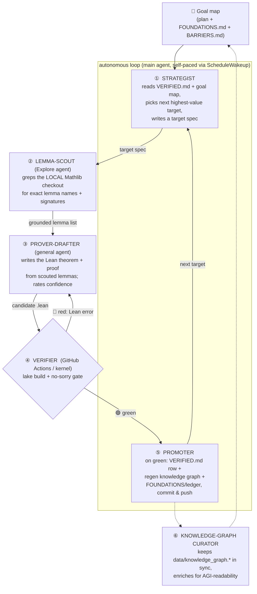

# Agent orchestration map — how the autonomous prover pipeline runs

This is the **live map** of the agents that drive the verified knowledge base forward
without manual input. It exists so a human can see, at a glance, *which agents run, how
they connect, and what each one is told to do*. The prompts below are the actual reusable
prompts — edit them here and the pipeline changes.

> **The one invariant is unchanged.** No agent ever certifies a proof. The only judge is
> the Lean kernel via GitHub Actions (`ci.yml`). Agents *propose*; CI *disposes*. A green
> build means every built theorem is fully proved, with no `sorry` and no new axioms.

## The pipeline

The cycle time is dominated by **④ VERIFIER** (~5 min: ~2 min Mathlib cache fetch +
~3 min build). Everything else is seconds. So the loop is paced to *promote the moment a
build goes green and immediately start the next target's build* — no Actions minutes idle.

## The agents and their prompts

### ① STRATEGIST — the main loop (me)
**Role.** Owns the goal map. Each cycle: read `VERIFIED.md` (what's proved), `notes/FOUNDATIONS.md`
+ `BARRIERS.md` (the frontier), pick the single highest-value *tractable* next theorem, and
write a one-paragraph target spec (statement intent + why it matters + which Mathlib area).
**Selection rule.** Prefer: (a) concrete arithmetic / structural facts with a known Mathlib
lemma, (b) nodes that tie abstract results to *secp256k1 specifically* (navigability),
(c) breadth over depth when a rung is research-grade (e.g. the Weil pairing stays open).
Never stack an unverified node on an unverified node; never promote before green.

### ② LEMMA-SCOUT — `Explore` subagent
**Prompt template:**
> You are scouting the LOCAL Mathlib checkout at `…/scratchpad/mathlib4` for a Lean 4
> (v4.31.0) formalization. There is NO Lean toolchain — correctness must come from reading
> source. For the target ⟨TARGET⟩, find the EXACT lemma names + signatures + file:line that
> would support a proof. Quote each verbatim. Flag coercion hazards (ℕ vs ℤ), instance
> requirements, and whether a lemma is `@[simp]`/`rfl`. Do not write proofs; return the
> grounded lemma inventory only.

### ③ PROVER-DRAFTER — `general-purpose` subagent
**Prompt template:**
> Using ONLY the scouted lemmas ⟨LEMMA LIST⟩, write the Lean theorem(s) for ⟨TARGET⟩ as
> complete `theorem … := by …`, ready to drop into ⟨FILE⟩ (`import Mathlib`, namespace
> ⟨NS⟩). No Lean toolchain exists, so reason carefully from the cited signatures. For each
> theorem give the full statement + proof, a confidence rating (high/med/low), and the
> exact risk if it fails. Prefer FEWER high-confidence theorems over many shaky ones.

### ④ VERIFIER — GitHub Actions (`ci.yml`), not an LLM
The trust boundary. `lake build` over `Ecdlp.lean` + the no-`sorry` scan (excluding
`Targets/`). Green ⟹ every listed theorem is kernel-proved. Red ⟹ the Lean error text is
fed back to ③ for repair.

### ⑤ PROMOTER — the main loop (me), only on green
Append the `VERIFIED.md` row, run `scripts/build_knowledge_graph.py`, update
`FOUNDATIONS.md`/targets status, commit & push. **Discipline (Taproot lesson):** a ledger
row is added *only after the build that contains the theorem is confirmed green.*

### ⑥ KNOWLEDGE-GRAPH CURATOR — `scripts/build_knowledge_graph.py` (+ periodic agent)
Regenerates `data/knowledge_graph.{json,md}` from the ledger so the asset stays navigable
for a future automated reasoner (the north star). `--check` mode fails CI on drift.

## What is deliberately NOT automated
- **Merge to `main`.** Promotions land on `claude/admiring-darwin-uouep1`; a human merges.
- **The Featherless model tiers.** Plan currently blocks API access (HTTP 403
  `upgrade_required`); the Tier-0 tactic ladder + the agent drafters cover the search for now.
- **The rented server.** At 4 GB it OOMs on `import Mathlib`; not cost-effective yet. The
  GitHub Actions → server bridge (`server-run.yml`) stays ready for a ≥8 GB box if needed.

## Status
Live. Ledger at 112 theorems (see `VERIFIED.md`). Stream-2 rung 1 (`E[n]` as a group
object) closed via Mathlib `torsionBy` + the bridge in `Ecdlp/Proved/Torsion.lean`.
