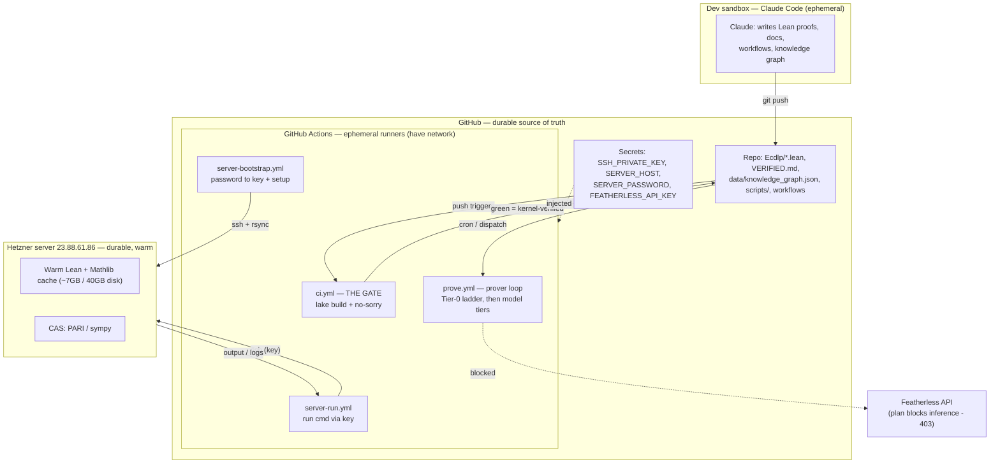

# System architecture

How the pieces connect: where code lives, what verifies it, and how the server is
driven. Durable + small → GitHub. Heavy + regenerable → the server's disk.
Everything else (CI runners, the dev sandbox) is ephemeral.

## Where everything lives

| What | Where | Size | Durable? |
|---|---|---|---|
| Code, proofs, `VERIFIED.md`, knowledge graph | **GitHub repo** | MB | yes — source of truth |
| Mathlib `.olean` cache, Lean toolchain, build | **server disk** (+ temp on runners) | ~5–7 GB | no — re-downloaded from CDN |
| CI / prover / bootstrap logs | **GitHub → Actions** (+ artifacts) | small | ~90 days |
| Machine-readable "schema" of knowledge | `data/knowledge_graph.json` (+ `.md`) | KB | yes |

## Trust boundary

The **Lean kernel** is the only judge. A green `ci.yml` (no `sorry`, no axioms) is the
sole proof of correctness. The server and the prover loop only *accelerate search*;
nothing they produce is trusted until `ci.yml` re-verifies it. `main` is never edited
by automation except via reviewed candidate PRs.

## Notes

- **Dev sandbox ↔ server:** the sandbox cannot reach the server (egress blocked), so
  all server work goes through GitHub Actions runners, which do have network access.
- **Featherless:** wired in but its subscription plan lacks API access (HTTP 403), so
  the model tiers are idle; Tier-0 + hand-written proofs carry the work today.
- **Google Drive:** not in the active pipeline. The claim corpus it once held now
  lives in `data/`; nothing writes back to Drive, so it does not grow.
